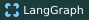
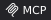
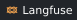
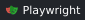

  <picture>
    <source media="(max-width: 600px)" srcset="assets/profile-cover-ai-mobile.svg?v=ai-cover" />
    
  </picture>

**AI Agent 开发工程师**

- [codex-bar ↗](https://github.com/j-tide/codex-bar) — 在 macOS 菜单栏查看 Codex 任务、额度与用量。
- [llmops ↗](https://github.com/j-tide/llmops) — LLM 应用开发实践。

## Technology Stack

  <strong>AI &amp; Agents</strong> 
  
  
  
  
  

  <strong>RAG &amp; Memory</strong> 
  
  
  
  

  <strong>Backend</strong> 
  
  
  
  
  
  

  <strong>Evaluation &amp; Reliability</strong> 
  
  
  
  

  <strong>Frontend</strong> 
  
  
  
  
  
  
  

  <strong>DevOps &amp; Tooling</strong> 
  
  
  
  

> 人一能之，己百之；人十能之，己千之。 果能此道也，虽愚必明，虽柔必强。

## GitHub Activity
<!-- Rolling 90-day contribution snake, generated daily from this account's real activity. -->

  

