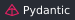

**AI Agent 开发工程师，拥有前端与全栈开发背景。**

关注工具调用、检索增强与 Agent 工作流，让 AI 应用解决具体问题。 
在 <a href="https://github.com/j-tide/llmops">llmops</a> 中实践 LLM 应用开发，也在维护 <a href="https://github.com/j-tide/codex-bar">codex-bar</a> 等日常开发工具。

## Technology Stack

  <strong>AI &amp; Agents</strong> 
  
  
  
  
  

  <strong>RAG &amp; Backend</strong> 
  
  
  
  
  

  <strong>Web</strong> 
  
  
  
  

  <strong>Native &amp; Tooling</strong> 
  
  
  

  
更多前端技术

HTML5 / CSS3 / JavaScript / Express / Koa / Webpack

> 人一能之，己百之；人十能之，己千之。 果能此道也，虽愚必明，虽柔必强。

## GitHub Activity
<!-- Rolling 90-day contribution snake, generated daily from this account's real activity. -->

  

