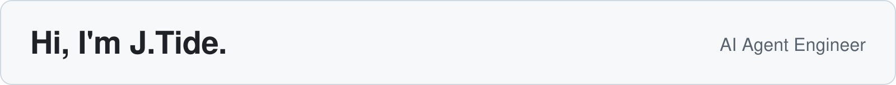

  <picture>
    <source media="(prefers-color-scheme: dark) and (max-width: 600px)" srcset="assets/profile-intro-mobile-dark.svg" />
    <source media="(max-width: 600px)" srcset="assets/profile-intro-mobile-light.svg" />
    <source media="(prefers-color-scheme: dark)" srcset="assets/profile-intro-dark.svg" />
    
  </picture>

以全栈开发为基础，专注工具调用、RAG 与 Agent 工作流。 
正在构建 <a href="https://github.com/j-tide/llmops">llmops</a>，并维护日常开发工具 <a href="https://github.com/j-tide/codex-bar">codex-bar</a>。

## Technology Stack

  <strong>AI &amp; Agents</strong> 
  
  
  
  
  

  <strong>RAG &amp; Backend</strong> 
  
  
  
  
  

  <strong>Web</strong> 
  
  
  
  

  <strong>Native &amp; Tooling</strong> 
  
  
  

  
更多前端技术

HTML5 / CSS3 / JavaScript / Express / Koa / Webpack

> 人一能之，己百之；人十能之，己千之。 果能此道也，虽愚必明，虽柔必强。

## GitHub Activity
<!-- Rolling 90-day contribution snake, generated daily from this account's real activity. -->

  

